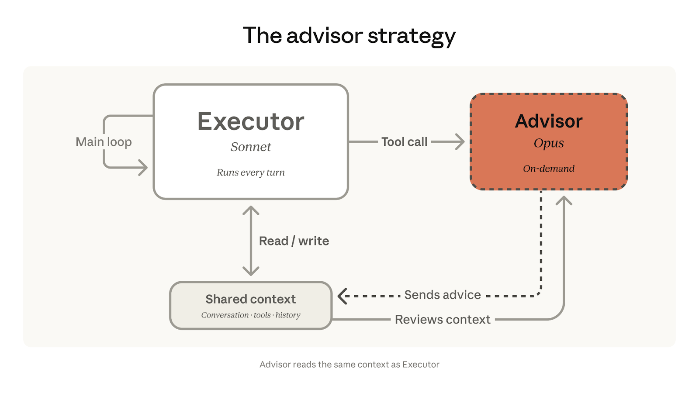
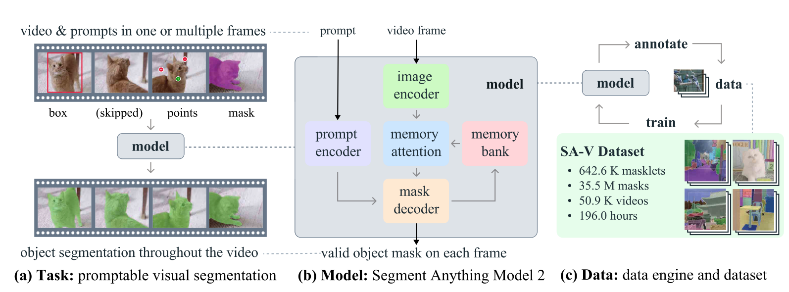
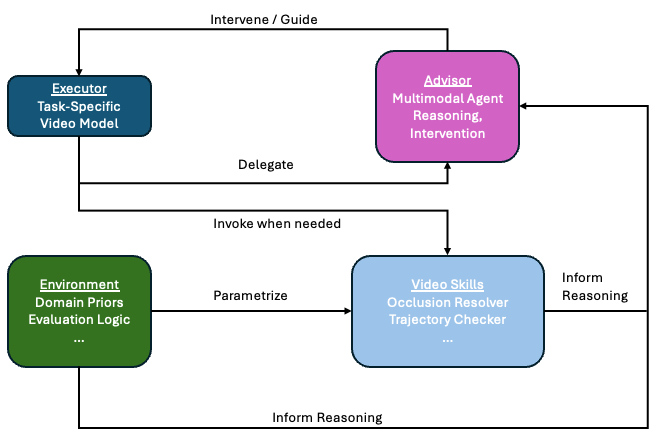

Modern video foundation models are powerful engines on which to transform raw video into other meaningful representations, but they are not agentic systems. These models can segment, track, caption, and generate, but they don’t have a concrete understanding of when they are wrong, how to reflect on and refine their outputs, or how to adapt their behavior over long time horizons. They just… well… segment, or track, or caption, or generate videos.

What’s missing from these models is an *orchestration layer*, the likes of which have emerged to power agentic models like Claude and GPT-5 to carry out impressive tasks. This layer can be thought of as a set of systems that sit above video models and manage error detection/correction, long-horizon reasoning, and intervention on the ordinary workflow of a model and inference layer designed to complete a single task. This layer would be composed of reusable *Video Skills*, or modular routines for tasks like instance resolution in Video Object Segmentation, or prompt-guided steering of video captioning, and so on. This layer would also consist of *Environments* that encode domain-specific structure, constraints, and inductive biases that steer model outputs. Together, these would allow video systems to move from *stateless* inference engines to *stateful* agents that can reason and delegate tasks to solve a user’s problem. As we have seen in NLP and code generation, the performance bottleneck is no longer a single model’s capability in responding adequately to a simple prompt. The bottleneck is orchestration: how models are composed, and how model outputs are monitored and corrected over time. The prompt “write a Python function to make a scatterplot on a Pandas DataFrame with columns `X` and `Y`” has been easy for LLMs for a while; the prompt “refactor the 100k-line web-app codebase located on my filesystem in directory XYZ and improve its memory footprint by at least 10%” is comparatively harder.

Layering orchestrators on top of video foundation models could enable long-horizon, reliable reasoning over videos. In practice, though, this infrastructure doesn’t really exist in any principled way like MCPs. There is certainly no substantial, active ecosystem around it like there is for current agentic tools like Claude. When things break, we fall back to ad-hoc hacks and sidestep edge cases. This becomes especially clear in a setting that I have been working in recently: long-horizon video object segmentation.

## My Experience with Video Foundation Models

I have spent a decent amount of time using Meta’s SAM3 (Segment Anything Model, Version 3) for long-horizon video object (instance) segmentation (VOS). It works well for short-horizon tasks, say even up to 1 minute. But inevitably, at some point in the video, one object instance occludes another, and the tracker gets confused, sometimes grouping the two instances into one, or swapping the instance identities. If the label propagation is allowed to continue, the rest of the tracking downstream is untrustworthy.

I’ve found that in order to achieve better long-horizon performance, I need to get into the weeds and write code that orchestrates a form of “proofreading”, such as detecting potential occlusions, identity swaps, and collapsed predictions, using time series statistics / anomaly detection on mask trajectories, and finding a set of frames that hit some threshold on a sort of “take a further look at these frames” metric. (e.g. if an instance’s mask moves too far from one frame to the next, or changes shape over a sequence of frames in a way that does not match our prior expectations)

## This requires domain knowledge: an example

A lot of this involves domain knowledge. Suppose we have a video of someone juggling three baseballs, and wish to track their segmentation mask trajectories over a minutes-long video. We have some prior information about the shape of trajectories the three instances should follow, so even if they occlude each other (or, say, they collide and end up following an unexpected trajectory) and the tracker can’t tell which is which, we can use information about the expected trajectories under different circumstances (normal juggling vs. mid-air collision) to help resolve exactly which baseball instance corresponds to which segmented mask.

SAM3-style video mask propagation is blind to this sort of prior information; it uses a simple label propagation method on a very strong set of image features and prior-frame-prediction, from frame to frame, which is why it tends to work so well at video object segmentation. We would need some way of encoding features of the expected joint trajectories and matching up some short-term trajectories (i.e. a few seconds of video over which each ball is caught and thrown in the air once) with them. This could look like providing positive and negative examples of trajectories that indicate proper identity tracking under different conditions. Some examples:

- Positive example under normal juggling conditions: the baseballs follow a relatively smooth arc from one hand `H[a]` to the other `H[b]`
- Negative example under normal juggling conditions: at least one baseball follows a semi-arc from one hand `H[a]` up in the air, until it overlaps another baseball’s segmentation mask, and then travels back to `H[a]` (this indicates an occlusion event followed by identity swap between the two baseballs)
- Positive example under normal collision event: the baseballs follow semi-arcs until their segmentation masks touch, then they begin to follow trajectories that satisfy conservation of momentum, which are different from the intended trajectories under normal gravity without collision, as if they were being juggled normally
- Negative example under normal collision event: the baseballs follow the same initial trajectories as above, but the post-collision trajectory of each does not align with the force applied to it from the other baseball, indicating an identity swap

This could be done with a physics engine, but could also be encoded by parametric functions arcs in 2 dimensions, then matching the 2D spatial statistics on trajectories in the 2D juggling video.

The point is not to claim that the SAM family of models cannot handle VOS for juggling videos – in fact, one of the SAM demos is of someone juggling a soccer ball.

The point is that there *are* many similar scenarios you may find yourself in when facing a VOS task, where similar-appearing objects occlude each other, an object moves in and out of the scene, or the model hits some other failure mode of label propagation, which collapses all predictions downstream of that frame.

What’s missing here is not a better segmentation model, but a *system* that knows when the model is likely to fail, how to detect that failure, and how to intervene appropriately. Right now, all of that logic lives in ad-hoc scripts, heuristics, and human intuition (it does for me, at least). There is no standardized orchestration layer that sits on top of video foundation models and manages long-horizon consistency, error detection, and recovery.

But there can and should be.

## Orchestration Layer: Executor-Advisor Strategy

One approach is the executor-advisor model: delegate most inference to an “Executor”, which is a more efficient, less-capable model. Pair the Executor with an “Advisor”, which is a more intensive yet more capable model, and a “delegation criterion” mechanism that instructs the system when to pass a task to the Advisor.

This design pattern is nicely described in a blog post by Anthropic: <https://claude.com/blog/the-advisor-strategy> (← figure credit)

And a paper written by scientists at UC Berkeley (<https://arxiv.org/abs/2510.02453>).

A natural question is: How can it be used for video tasks? Let’s explore the case of VOS.

## Executor-Advisor Strategy for Long-Horizon Video Object Segmentation

### Advisor 1: Human annotator

In my experience, for offline VOS, adding some manually-annotated frames sparsely throughout a video and then batching the label propagation simply just works. You can use SAM2/3 with simple frame-by-frame label propagation and this “anchoring” strategy for most tasks, and for stable scenes (i.e. without objects moving in and out of the frame), it just works. You can pretty much perfectly track segmentation masks throughout arbitrarily long videos this way.

There are some cases where objects might appear/disappear, either due to occlusion or the camera’s limited field of view. What do you do then?

### Advisor 2: Memory Bank of Visual Prompts

Here’s the general Segment Anything workflow: after loading in an image, you first provide a visual prompt, such as a point or a bounding box, on an object in the frame. SAM encodes that prompt, embeds the image with a pretrained model, and jointly passes the embeddings of the visual prompt and image to a mask decoder, which predicts a segmentation mask. The next point is critical for inference on new frames: the image embedding and predicted mask are added to a memory bank, and during inference, for new frames without visual prompts, cross-attention is calculated between the embedding of the image to be predicted and the embedding(s) of the image(s) in the memory bank.

In the simplest case for VOS inference at frame `t`, the memory bank contains the embedding of the image at the previous frame `t-1` along with its predicted mask. Then cross-attention is calculated between embeddings at frames `t-1` and `t` and a mask is predicted for `t`.

See the following diagram from the SAM2 paper: (<https://arxiv.org/pdf/2408.00714>)

However, suppose a new object enters the scene, or an object already in the scene becomes occluded and then re-enters the scene. SAM won’t know what to do, since the mask for this object would have dropped out when the occlusion occurred. (There are ways to estimate locations of objects in the presence of occlusion, but let’s leave that for another time.)

But suppose in the course of your manual annotation of segmentation masks, you labeled not just the first frame of the video, but a dozen frames, capturing a diverse set of objects that may not have been in the scene at the first frame. These objects are stored in the memory bank and used to infer the segmentation masks on each new frame. The model is likely to find these novel objects upon entrance to the scene. Indeed, this has been my experience.

### Advisor 3: Multimodal Agent

Even with a rich memory bank, failure modes still arise when objects undergo appearance changes (lighting shifts, motion blur, deformation, etc), when multiple similar instances interact in complex ways (e.g. prolonged occlusion with nontrivial re-emergence), or when the scene itself changes (camera motion, zoom, cuts). In these cases, the model may produce masks that are locally plausible but globally inconsistent over time, e.g. identity drift that accumulates slowly rather than catastrophically. These are particularly insidious because they evade simple threshold-based detection and require higher-level reasoning over temporal structure, object identity, and sometimes even semantics (“this object should not teleport”, “these two instances should not merge permanently”, etc). You can encode knowledge of the environment into a text prompt, for instance something like “There are exactly 3 baseballs being juggled, first try to segment all three; if you cannot find 3, it is likely that there is an occlusion, or at least one has been tossed out of the camera’s field of view, or at least one has been dropped, so if you cannot find 3, do a binary search to find the most recent frame in which you can find 3, starting 100 frames previous in the video. Then determine the trajectories to see if there was an occlusion; if so, estimate where it would be now, otherwise …” you get the picture.

Not that you would actually do this, but the example I’ve shown is an intuition pump that helps us see how you might use a text-image multimodal, tool-calling agent with read-access to the video that can reason across frames to diagnose what failure mode, just like a human annotator would. You could even have it compile the tools it might need to use prior to starting the VOS task, so it doesn’t need to write a python/shell script to handle the I/O, trajectory processing, and so forth each time.

Using a multimodal agent like this is more compute-intensive, and in my experience it takes several seconds or more to run on a single frame, so while running it on every frame would likely yield the best VOS results, it is impractical to use it for long-horizon videos, and thus should be used only as a last-resort advisor.

## What are the delegation mechanisms?

### Delegation mechanism 1: Anomaly Detection over mask trajectories

At a high level, the delegation mechanism should estimate the probability that the current trajectory state is “off-manifold” relative to expected behavior. More concretely, you can think of maintaining a latent state for each object’s trajectory (position, velocity, shape descriptors, embedding similarity to prior masks, etc.), and modeling its evolution over time.

An initial approach would be to use threshold handcrafted statistics, such as high-frequency spikes in a mask’s centroid position, large changes in mask size, or drops in embedding similarity across frames. More sophisticatedly, you could define a generative model over historical object trajectories (e.g. Gaussian process) and compute likelihoods of trajectories under these models. Trajectories that fall below a given likelihood threshold could be delegated to an advisor.

In the juggling example, this becomes especially natural: you can explicitly model expected parabolic motion under gravity, and deviations from that model (outside of collision events) become strong signals of identity swaps or tracking failure. The exact modeling parameters would be a function of camera angle, and could change if the camera is moving, so the modeling would perhaps need to be done over recent frames, but that’s neither here nor there.

### Delegation mechanism 2: Cross-Attention score thresholding between an inference frame and memory bank

Cross-attention scores between the current frame and memory bank provide a direct signal of how well the model can “ground” the current observation in representations of previous frames. If the maximum (or aggregate) attention score across the memory bank drops below a threshold, it suggests that the model is extrapolating rather than matching to known instances. Such a drop could indicate that a new object has appeared, or a known object has dropped out of the frame.

One variant of this idea is global thresholding: if no memory bank entry achieves sufficient attention, trigger advisor intervention or even re-annotation. This could indicate that the scene is sufficiently different from what has been labeled previously that simple label propagation is not useful.

Another variant is per-instance thresholding, i.e. detect when a specific object’s attention distribution becomes diffuse or shifts abruptly between memory entries. This indicates identity ambiguity – maybe objects merged, for instance. An advisor would be called upon to resolve this object’s identity or split apart mistakenly merged objects.

## Video Skills

On top of an executor–advisor setup, I envision an analogue of Claude Agent Skills (<https://platform.claude.com/docs/en/agents-and-tools/agent-skills/overview>), but for video systems. Think of this as a modular layer of *“Video Skills”*: a repository of reusable inference routines, lightweight models, and structured procedures that can be dynamically invoked during video processing.

Some meta-level Skills might include:

- a **“trajectory consistency” skill** that fits parametric curves or physics-based models to object motion and flags inconsistencies,
- an **“occlusion resolver” skill** that analyzes mask overlap and reassigns identities post-occlusion,
- a **“re-identification” skill** that matches objects across long temporal gaps using embedding similarity and spatial priors.

We may also consider a repository of “environments”, domain-specific bundles of information, tools, and evaluation logic that shape how video tasks are performed in a given context. If Video Skills are modular model capabilities, environments comprise the *contextual scaffolding* that determines which skills are relevant at what points in the video, how they are parameterized, and what “correct behavior” looks like.

An environment could include domain-specific dynamical priors. The dynamics of cells under a fluorescent microscope are different from the dynamics of mice in a behavioral neuroscience experiment, which are different from the dynamics of fruit flies, and so on.

An environment would also include domain-specific Skills, object descriptions, and evaluation logic that determines how “fit” a model output or an advisor intervention is.

Here is one example environment off the top of my head: live-cell tracking in time-lapse microscopy.

### Live-cell tracking in time-lapse microscopy

This can be a challenging domain. Statistics of cell trajectories can change depending on the sampling rate and resolution. Signal intensity can fluctuate due to noise/photobleaching. Cells divide, deform, interact, and die. An environment would encode all of these constraints and expectations, given the experimental parameters.

A concrete example of a Skill in this environment is “lineage tracing”: detecting mitosis events and maintaining correct identities as cells divide. To support robust instance segmentation across frames in the presence of mitosis, we can structure the problem as follows:

1. **Define an identity update rule.** When a division event occurs, a single instance transitions into two daughter instances:  
    `X_n → {X_{n1}, X_{n2}}`  
    This explicitly encodes that identity is not conserved as a single trajectory, but instead branches into a lineage.

2. **Detect mitosis events.** Train a video classifier over short temporal windows (e.g., N consecutive frames) to identify when a cell division is occurring. During inference, this detector is applied periodically (e.g., every frame or every few frames) to flag candidate mitosis events.

3. **Enforce consistency between detection and segmentation.** When a mitosis event is detected, the segmentation and tracking outputs should be updated to reflect the branching structure. Concretely:

    - the parent instance `X_n` is terminated,
    - two new instances `X_{n1}, X_{n2}` are initialized,
    - and subsequent mask propagation proceeds independently for each daughter cell.

The key idea is that segmentation is no longer treated as simple identity propagation, but as a *structured process with domain-specific transition rules*. This allows the system to remain consistent with biological reality, rather than forcing a generic tracker to implicitly handle events like cell division with proper lineage tracing.

Finally, the evaluation logic in the environment could include biologically plausible motion and division rates, and consistency with known cell cycle timing, for the given cell type and experimental conditions.

Put together, the following adaptation of Anthropic’s Orchestration Diagram might look like the following diagram I’ve assembled:

Skills and Environments can be used for arbitrary video tasks, such as video object segmentation, autonomous video editing, and scoring of AI-generated videos, to name a few.

I have hardly scratched the surface. The orchestration layer for long-horizon agentic video processing is ripe for innovation. Let’s build it.

---

*Originally published on [Future and Ever](https://futureandever.substack.com/p/the-orchestration-layer-for-video).*
